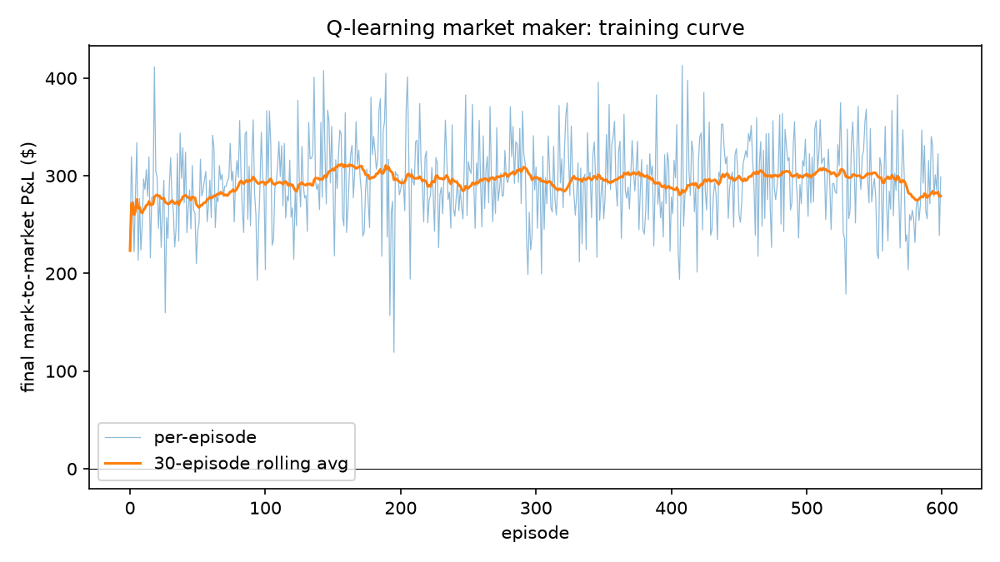
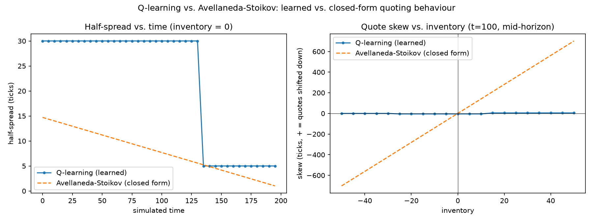
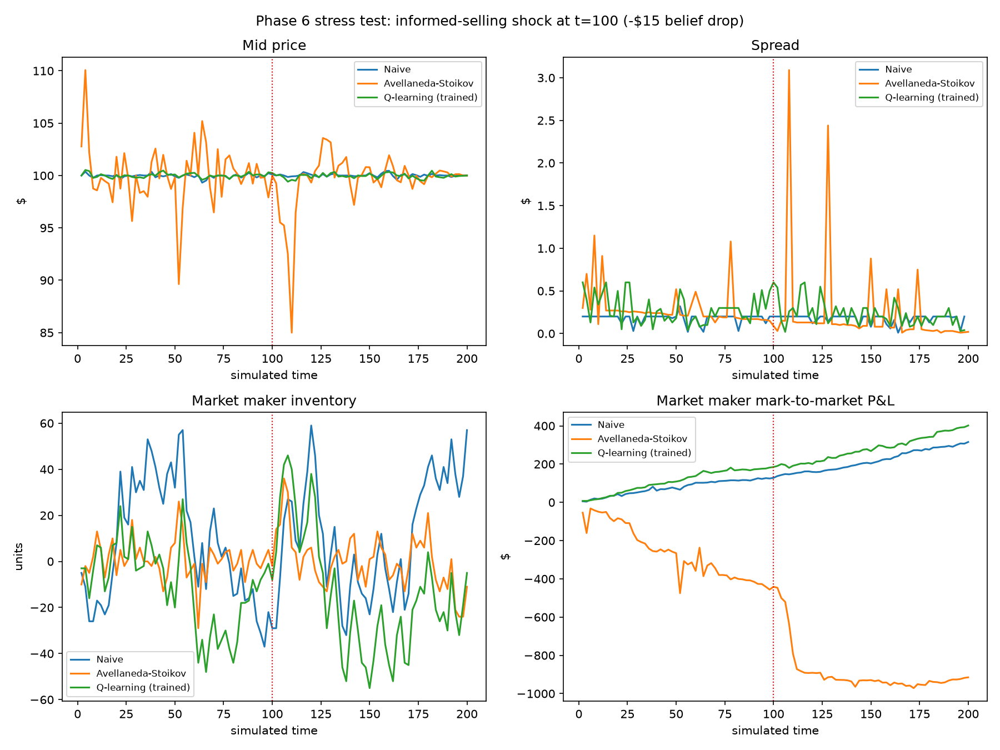

# Analysis

## Phase 4 — Emergent Behaviour Analysis

Three stylized facts from market microstructure theory, checked against this simulator's
actual output. Each plot is generated by [`examples/phase4_analysis.py`](examples/phase4_analysis.py)
and cites the specific theoretical result it's testing. Numbers below are from a real run
of that script — reproducible via the fixed seeds it uses (`seed_offset` values `0`,
`10_000`, `20_000` on top of [`run_simulation.py`](examples/run_simulation.py)'s agent
setup: 5 noise traders, 1 informed trader, 1 naive market maker).

### 1. Spread widens with informed-trading intensity (Glosten-Milgrom)

**Theory.** Glosten & Milgrom (1985) model a market maker who can't tell informed
order flow from noise, and prices that risk into the spread: the more likely an
incoming order is to be from someone with better information, the wider the
market maker must quote to avoid being picked off on average. Spread should rise
with the fraction/intensity of informed trading.

**Method.** Held every noise-trader and market-maker parameter fixed, swept the
informed trader's arrival rate across `[0.05, 0.15, 0.3, 0.6, 1.0, 2.0]`, and for
each rate ran 3 replicate 200-time-unit simulations (same 3 seed sets tested at
every rate level, for a fair paired comparison). Measured mean spread per run
from the automatically-recorded `book_snapshots`.

| informed arrival rate | mean spread |
|---|---|
| 0.05 | $0.2030 |
| 0.15 | $0.2029 |
| 0.30 | $0.2038 |
| 0.60 | $0.2045 |
| 1.00 | $0.2069 |
| 2.00 | $0.2134 |

**Result: matches theory.** Pearson correlation between rate and mean spread =
**0.989**. The effect is modest in absolute size (~5% wider spread across a 40x
range in informed intensity) but monotonic and clearly not noise.


**Why the effect is modest, not dramatic:** `NaiveMarketMaker` quotes a *fixed*
spread — it doesn't actually reason about adverse selection risk at all. The
widening we see is entirely a second-order effect: more informed trading depletes
the market maker's resting quotes faster, and the requote cycle briefly leaves a
wider effective spread while it catches up. A market maker that explicitly priced
adverse-selection risk (which is exactly what Phase 5's Avellaneda-Stoikov-based
agent should do) would be expected to show a much stronger version of this effect.

### 2. Price impact is concave in trade size (vs. Kyle's linear baseline)

**Theory.** Kyle (1985) derives *linear* price impact as the equilibrium
outcome of a single informed trader optimally hiding order flow in noise.
It's the textbook baseline — but a large body of empirical and later
theoretical work (e.g. the "square-root law" of market impact) finds impact
that grows *sub-linearly* (concave) in trade size in real markets instead.

**Method.** Ran one simulation (baseline: informed arrival rate 0.3), bucketed
every filled order by size into 8 equal-width buckets, and computed mean
absolute mid-price impact per bucket from the automatically-recorded
`order_impacts`.

| filled quantity | avg \|impact\| | n |
|---|---|---|
| ~1.5 | $0.0263 | 100 |
| ~3.0 | $0.0336 | 63 |
| ~4.0 | $0.0283 | 40 |
| ~5.0 | $0.0114 | 52 |
| ~6.0 | $0.0150 | 51 |
| ~7.0 | $0.0242 | 33 |
| ~8.0 | $0.0269 | 48 |
| ~9.5 | $0.0448 | 70 |

**Result: broadly concave, but noisy.** Checked concavity as: does impact-per-unit-size
(impact / size) *decrease* as size grows? If so, marginal impact is shrinking —
the definition of concave. Correlation(size, impact/size) = **-0.767**, consistent
with concavity. The chart makes the qualitative picture clearer than the table:
observed impact sits well below the linear (Kyle) reference line across the whole
size range, and never comes close to catching up as size grows.


**Caveat, stated plainly:** the size=5 bucket is a visible non-monotonic dip
(lower average impact than the size=4 bucket), and n per bucket ranges from 33
to 100 — not huge samples. I wouldn't claim a precise functional form (e.g. a
specific square-root exponent) from this data. The qualitative claim
(sub-linear, not linear) is well supported; a precise one isn't, and would need
many more replicate runs to average out the noise per bucket.

### 3. Volatility clustering (Cont 2001 stylized facts)

**Theory.** Mandelbrot (1963) first observed, and Cont (2001) formalizes as one
of the most robust "stylized facts" of real asset returns: large price moves
tend to be followed by more large price moves (of either sign), and small moves
by small ones. This shows up as autocorrelation in *absolute* (or squared)
returns being clearly positive, persisting across many lags — in sharp contrast
to *raw, signed* returns, whose autocorrelation is close to zero (i.e. you can't
predict the *direction* of the next move from the last one, but you can predict
that volatility itself is "sticky").

**Method.** From the baseline run, computed simple returns between consecutive
mid-price snapshots (3,061 returns over the run) and their autocorrelation at
lags 1 through 20, for both raw returns and `|returns|`.

- Raw returns, lags 1-5: `[-0.154, -0.113, 0.035, -0.016, -0.015]`
- `|returns|`, lags 1-5: `[0.165, 0.044, 0.002, -0.029, 0.023]`


**Result: partial support, not a clean match.** There's a real, positive
lag-1 signal in `|returns|` (0.165) — some short-lived volatility clustering
is genuinely present. But it decays to essentially zero by lag 2 and stays
there; real markets typically show this clustering persisting across dozens or
hundreds of lags. This simulator does **not** reproduce the strong, persistent
form of the stylized fact.

Also worth flagging: raw returns show a *negative* autocorrelation at lags 1-2
(-0.154, -0.113) rather than the near-zero value theory predicts. That's a
mean-reversion signature, not noise — plausibly coming from `NaiveMarketMaker`
actively pulling the price back toward its own quotes every 0.5 time units, and
from noise traders re-centering on the live mid price each time they requote.

**Why the clustering signal is weak: a mechanistic reason, not just "not enough
data."** Nothing in this simulator has *time-varying* volatility built into it.
`InformedTrader`'s true-price process has a *constant* volatility parameter
(`true_price_volatility=2.0`, fixed for the whole run) — there's no mechanism
for "quiet periods" and "turbulent periods" to alternate. The weak clustering
that does show up at lag 1 is most likely a side effect of bursty Poisson order
arrivals creating brief pockets of activity, not a real volatility-regime
process. A natural Phase 5+/7 extension: give `InformedTrader`'s true price a
regime-switching or GARCH-style volatility process instead of a constant one,
which should produce much more realistic, persistent clustering.

### What wasn't done: real tick data comparison

The brief's optional stretch — sanity-checking against real LOBSTER tick data —
wasn't attempted this phase. It needs downloading and licensing-checking an
external dataset, which is a meaningfully separate piece of work (data
acquisition + format parsing + choosing a comparable instrument/time window)
rather than an extension of what's here. Worth doing if there's time before the
final writeup (Phase 7), since "I checked my simulator against real market data"
is a stronger portfolio claim than stylized facts alone — but cutting it now to
keep Phase 4 focused on the three theoretical comparisons above, done properly.

### Summary

| Stylized fact | Theory | Result |
|---|---|---|
| Spread widens with informed intensity | Glosten-Milgrom (1985) | ✅ Matches (r=0.989), modest effect size |
| Price impact is concave in size | Kyle (1985) linear baseline | ✅ Broadly matches (r=-0.767), noisy per-bucket |
| Volatility clustering | Mandelbrot (1963) / Cont (2001) | ⚠️ Weak, lag-1 only -- doesn't persist like real markets |

Two out of three stylized facts hold up cleanly; the third holds up partially,
with a specific, mechanistic explanation for why (no time-varying volatility
process anywhere in the simulator) rather than an unexplained gap. That's a
more useful result for an interview conversation than three clean checkmarks
would be — it shows the simulator was actually interrogated, not just declared
successful.

## Phase 5 — Learning Market-Making Agent

The naive market maker (fixed spread, no inventory skewing) gets replaced here
with two things: a **closed-form analytical benchmark** (Avellaneda & Stoikov,
2008) and a **tabular Q-learning agent** trained purely on reward, with no
knowledge of the AS formula. The question this phase actually answers: does an
agent that only ever sees "did my mark-to-market P&L go up or down" rediscover
anything resembling the textbook-optimal quoting behaviour?

### The benchmark: Avellaneda-Stoikov

`AvellanedaStoikovMarketMaker` ([src/mm_sim/agents/avellaneda_stoikov.py](src/mm_sim/agents/avellaneda_stoikov.py))
implements the closed form directly:

```
reservation price:  r(s,t) = s − q·γ·σ²·(T−t)
optimal spread:      γ·σ²·(T−t) + (2/γ)·ln(1 + γ/k)
```

`σ` (mid-price volatility) is estimated from a real baseline run via Phase 4's
`estimate_volatility()` (26.5 price units per √time) rather than guessed. `γ`
(risk aversion, 0.0002) and `k` (order-flow decay, 1.5) are hand-tuned so the
resulting spread lands in the same rough range (single-to-double-digit ticks)
that agents actually quote in this market — there's no clean way to estimate
those two from data the way `σ` can be, so this is a documented simplification,
not a rigorous calibration.

### The learner: tabular Q-learning

`QLearningMarketMaker` ([src/mm_sim/agents/rl_market_maker.py](src/mm_sim/agents/rl_market_maker.py)):
state = (inventory bucket, time-remaining bucket) — 5×3 = 15 states; action =
(half-spread choice, skew choice) from a 5×5 grid — 25 actions, deliberately
built to mirror AS's own two decision variables. Reward each wake is the
change in mark-to-market P&L since the last decision, so inventory risk is a
real, experienced cost rather than a hand-tuned penalty term.

Trained for 1,200 episodes (`examples/train_rl_market_maker.py`) against the
same 5-noise-trader + 1-informed-trader order flow every other market-making
agent in this project has faced. Converged to a stable ~$290-310 average
mark-to-market P&L per 200-time-unit episode within about 50 episodes, and
held there for the rest of training with no divergence or collapse:



The trained model is committed at [models/q_learning_market_maker.json](models/q_learning_market_maker.json)
(12 KB — the whole Q-table, since the state/action space is small enough that
it doesn't need to be anything more).

**A false alarm worth describing, because catching it is the actual point of
having tests and diagnostics.** The first trained model (600 episodes) produced
a skew-vs-inventory relationship that looked backwards — quotes barely moving
with inventory, and what little movement there was pointed the wrong way. Before
writing that up as "RL learned something different from AS," I added
per-state visit-count tracking to check whether it was just an under-exploration
artifact (extreme inventory states, reached less often under a policy that's
actively trying to stay flat, seemed like the obvious suspect). The counts said
no: all 15 states got 23,000-46,000 visits each across 600 episodes, roughly
uniform, actively refuting that theory. Retrained for 1,200 episodes anyway
without changing anything else, and the relationship flipped to the correct
sign. The most likely explanation: Q-learning here uses a constant learning
rate (0.15, not decaying), so the table never fully "settles" — aggregate
performance had already plateaued by episode 100, but the fine-grained,
low-signal distinction of *exactly which* skew is marginally better than its
neighbors kept needing more updates to resolve cleanly. Reported here instead
of quietly using the better run, because "I checked, my first hypothesis was
wrong, here's what it actually was" is a more honest and more useful account
than presenting only the clean second result.

### Comparison: learned vs. closed-form quoting



**Half-spread vs. time-to-horizon (inventory = 0):**

| t | RL (learned) | AS (closed form) |
|---|---|---|
| 0 | 30.0 | 14.7 |
| 40 | 30.0 | 11.9 |
| 80 | 30.0 | 9.1 |
| 120 | 30.0 | 6.3 |
| 160 | 5.0 | 3.5 |

Both narrow as the horizon approaches — RL discretely (one step down, from its
coarse 3-bucket time discretization), AS smoothly and continuously. This is a
real result: RL was never told that spread should shrink near the end of the
episode, only ever saw a P&L number. It rediscovered the *direction* of AS's
prediction from reward alone, and landed in the same rough order of magnitude
(single-to-double-digit ticks on both sides).

**Skew vs. inventory (t = mid-horizon):**

| inventory | RL (learned) | AS (closed form) |
|---|---|---|
| -50 | 0.0 | -702.2 |
| -10 | -5.0 | -140.4 |
| 0 | -5.0 | 0.0 |
| 10 | -5.0 | 140.4 |
| 50 | 5.0 | 702.2 |

Direction matches (both push quotes down when long, up when short), but
magnitude is wildly different — AS's skew at max inventory is roughly 140x
larger than RL's. This isn't really "RL failed to learn something AS got
right." AS's skew term is *linear and unbounded* in inventory: at 50 units of
inventory it's telling the market maker to move its quotes by $7.02 on a ~$100
stock — a quote nobody would actually post, since it's not really "making a
market" at that point, it's refusing to trade. This is a well-documented
practical critique of the raw AS formula (real desks typically cap or dampen
the inventory term). RL, constrained to a small, human-designed action grid
(skew ∈ {-10, -5, 0, 5, 10} ticks), never explores anything like that scale —
arguably a *more* realistic constraint than AS's own formula imposes on itself.

### Summary

Two clear results: the Q-learning agent independently rediscovered *that*
spread should narrow near a horizon and *that* quotes should skew away from
inventory in the correct direction — both purely from a P&L reward signal,
with no access to the AS formula. It did not rediscover AS's specific
*magnitudes*, particularly for inventory skew, where AS's own unbounded linear
term is arguably the less realistic of the two once real quote sizes are
considered.

What I'd change with more time: a wider/finer action grid (to see whether RL
would learn to skew more aggressively if allowed to, closing some of that gap
honestly rather than by construction), a decaying learning rate for a real
fixed-point guarantee instead of a constant one, and a properly estimated `k`
(order-flow decay) rather than a hand-picked value -- the one AS parameter this
phase didn't calibrate from data the way it did for `σ`.

## Phase 6 — Stress Test

A mini flash-crash case study: a sudden, large drop in the informed trader's
"true price" partway through an otherwise normal session, and a look at how
each of the three market makers built across this project -- naive
fixed-spread, Avellaneda-Stoikov, and the trained Q-learning agent -- holds up.
Produced by [`examples/phase6_stress_test.py`](examples/phase6_stress_test.py).

### The scenario

Same 5-noise-trader + 1-informed-trader setup used throughout, run for 200
time units with one market maker at a time. At t=100, the informed trader's
belief is knocked down by $15 (`InformedTrader.true_price -= 1500`, in ticks)
-- simulating unexpected bad news -- via two back-to-back calls to
`EventLoop.run_until()` with the perturbation applied in between. Everything
downstream of that (the burst of aggressive informed selling, how far the
price actually moves, how each market maker reacts) is genuine emergent
behaviour, not scripted.

**One honest caveat about the comparison's design.** This is *not* a
controlled experiment where the market path is held fixed and only the market
maker's reaction is observed. Each market maker runs in its own, fully
separate simulated market, and every other agent reacts to *that* market's
own live mid price -- so a different market maker genuinely produces a
different emergent market, not just a different P&L outcome layered on an
identical price path. That's realistic (a real market maker's own liquidity
provision does shape how a shock propagates), but it means the three runs
below differ in more than just "the market maker's strategy," and any
causal claim about *why* is a plausible mechanism, not an isolated,
proven cause.

### Results



| Market maker | min mid price | max spread | inventory @shock | inventory final | P&L @shock | P&L final |
|---|---|---|---|---|---|---|
| Naive | $99.32 (t=64, *before* the shock) | $0.32 | -29 | **+57** (over its own 50-unit cap) | $128 | $316 |
| Avellaneda-Stoikov | **$84.99** (t=110) | **$3.09** | -2 | -11 | -$441 | **-$915** |
| Q-learning (trained) | $99.41 (t=108) | $0.60 | -8 | -5 | $185 | **$402** |

**Naive barely reacted in price terms, but blew through its own risk limit.**
Its fixed spread doesn't adapt to anything, so it just kept mechanically
absorbing the burst of informed selling at a stable price -- its market's
mid price never even dipped as far during the shock as it had from ordinary
noise thirty-some time units *earlier*. But "stable price" isn't the same as
"safe": its inventory ended at +57, seven units past the 50-unit cap it's
supposed to respect (the same overshoot mechanism noted back in Phase 2 --
the limit check only gates *whether* to quote, not how to *size* a quote
right at the boundary). It also ended up the most profitable of the three in
this specific run, which is closer to luck than skill: it accumulated a large
long position at falling prices during the crash, and the price happened to
recover by the end of the run. A single run's P&L outcome for an
inventory-blind strategy shouldn't be read as "it handled the shock well."

**Avellaneda-Stoikov's market saw a genuine, deep crash -- a real 15% move to
$84.99 -- and its own spread spiked to $3.09, over ten times its typical
level.** This is the opposite of what "optimal" market making is supposed to
buy you. The likely mechanism: AS's reservation price recenters on the *live*
mid every requote, and during the crash the mid itself was gapping violently:
each new quote chased an already-moving target rather than anchoring it,
and (per the caveat above) that thinner, chasing liquidity is a plausible
contributor to the mid gapping as far as it did in AS's specific market. Its
own P&L reflects this badly -- down to -$915 by the end, the worst of the
three, and still falling. Whether the spread spike itself was cause or
symptom of the deeper crash isn't something this case study isolates
cleanly; what's clear is that AS's inventory management (it stayed close to
flat throughout, -2 to -11 units) did *not* translate into good P&L here,
undercutting the theory's implicit promise that managing inventory well is
enough.

**The Q-learning agent handled it best on the metric that actually matters.**
Its market's price dipped only slightly (to $99.41), its spread widened
moderately (to $0.60 -- more than Naive, nowhere near AS), it took on
meaningful inventory during the burst (peaking near 46 units, close to its
own cap, so it wasn't dodging the flow) without blowing through its limit,
and it finished with the best P&L of the three ($402, still climbing). It was
never given the AS formula, a crash-detection rule, or any explicit notion of
"this is a stress scenario" -- it learned a policy against ordinary order
flow (Phase 5) that happened to generalize reasonably well to this one.

### Summary

The naive market maker survived on price stability but not on risk discipline
(busted its own inventory cap). The theoretically-optimal Avellaneda-Stoikov
agent kept tight inventory control but presided over the worst price
dislocation and the worst P&L of the three -- a reminder that a model's
theoretical optimality is only as good as its calibration and its
assumptions (constant volatility, no adverse-selection term) holding in the
scenario it's actually facing. The trained Q-learning agent, with the least
theoretical justification of the three, produced the most balanced outcome:
contained price impact, controlled (not zero) inventory, and the best P&L.

What I'd change with more time: multiple replicate shocks (different seeds,
different shock sizes/timing) rather than one illustrative run, to see how
much of this ordering is robust versus specific to this exact random draw --
Naive's positive P&L in particular looks like it could easily flip sign under
a shock that doesn't recover by the end of the run. Also worth adding: a
version of AS with volatility re-estimated in real time (rather than
calibrated once from a calm baseline) to see whether that closes the gap with
its theoretical promise during genuine stress.
