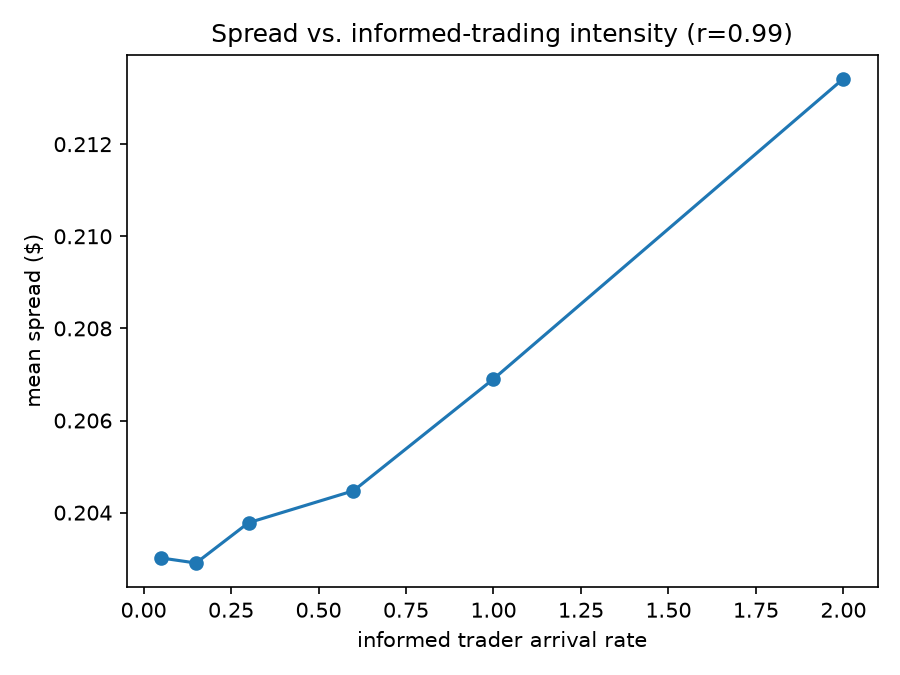
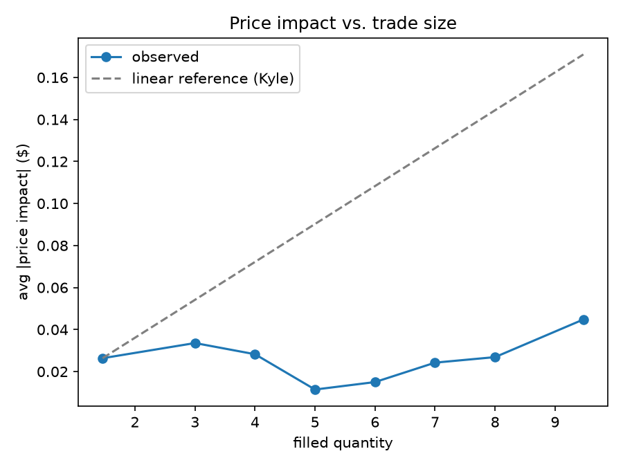
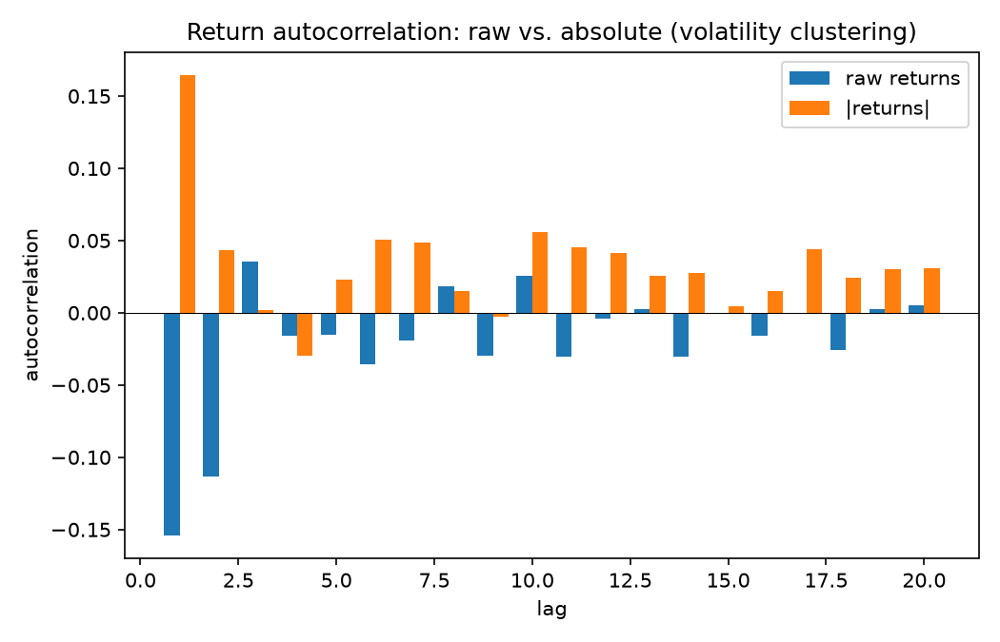

# Phase 4 — Emergent Behaviour Analysis

Three stylized facts from market microstructure theory, checked against this simulator's
actual output. Each plot is generated by [`examples/phase4_analysis.py`](examples/phase4_analysis.py)
and cites the specific theoretical result it's testing. Numbers below are from a real run
of that script — reproducible via the fixed seeds it uses (`seed_offset` values `0`,
`10_000`, `20_000` on top of [`run_simulation.py`](examples/run_simulation.py)'s agent
setup: 5 noise traders, 1 informed trader, 1 naive market maker).

## 1. Spread widens with informed-trading intensity (Glosten-Milgrom)

**Theory.** Glosten & Milgrom (1985) model a market maker who can't tell informed
order flow from noise, and prices that risk into the spread: the more likely an
incoming order is to be from someone with better information, the wider the
market maker must quote to avoid being picked off on average. Spread should rise
with the fraction/intensity of informed trading.

**Method.** Held every noise-trader and market-maker parameter fixed, swept the
informed trader's arrival rate across `[0.05, 0.15, 0.3, 0.6, 1.0, 2.0]`, and for
each rate ran 3 replicate 200-time-unit simulations (same 3 seed sets tested at
every rate level, for a fair paired comparison). Measured mean spread per run
from the automatically-recorded `book_snapshots`.

| informed arrival rate | mean spread |
|---|---|
| 0.05 | $0.2030 |
| 0.15 | $0.2029 |
| 0.30 | $0.2038 |
| 0.60 | $0.2045 |
| 1.00 | $0.2069 |
| 2.00 | $0.2134 |

**Result: matches theory.** Pearson correlation between rate and mean spread =
**0.989**. The effect is modest in absolute size (~5% wider spread across a 40x
range in informed intensity) but monotonic and clearly not noise.

**Why the effect is modest, not dramatic:** `NaiveMarketMaker` quotes a *fixed*
spread — it doesn't actually reason about adverse selection risk at all. The
widening we see is entirely a second-order effect: more informed trading depletes
the market maker's resting quotes faster, and the requote cycle briefly leaves a
wider effective spread while it catches up. A market maker that explicitly priced
adverse-selection risk (which is exactly what Phase 5's Avellaneda-Stoikov-based
agent should do) would be expected to show a much stronger version of this effect.

## 2. Price impact is concave in trade size (vs. Kyle's linear baseline)

**Theory.** Kyle (1985) derives *linear* price impact as the equilibrium
outcome of a single informed trader optimally hiding order flow in noise.
It's the textbook baseline — but a large body of empirical and later
theoretical work (e.g. the "square-root law" of market impact) finds impact
that grows *sub-linearly* (concave) in trade size in real markets instead.

**Method.** Ran one simulation (baseline: informed arrival rate 0.3), bucketed
every filled order by size into 8 equal-width buckets, and computed mean
absolute mid-price impact per bucket from the automatically-recorded
`order_impacts`.

| filled quantity | avg \|impact\| | n |
|---|---|---|
| ~1.5 | $0.0263 | 100 |
| ~3.0 | $0.0336 | 63 |
| ~4.0 | $0.0283 | 40 |
| ~5.0 | $0.0114 | 52 |
| ~6.0 | $0.0150 | 51 |
| ~7.0 | $0.0242 | 33 |
| ~8.0 | $0.0269 | 48 |
| ~9.5 | $0.0448 | 70 |

**Result: broadly concave, but noisy.** Checked concavity as: does impact-per-unit-size
(impact / size) *decrease* as size grows? If so, marginal impact is shrinking —
the definition of concave. Correlation(size, impact/size) = **-0.767**, consistent
with concavity. The chart makes the qualitative picture clearer than the table:
observed impact sits well below the linear (Kyle) reference line across the whole
size range, and never comes close to catching up as size grows.

**Caveat, stated plainly:** the size=5 bucket is a visible non-monotonic dip
(lower average impact than the size=4 bucket), and n per bucket ranges from 33
to 100 — not huge samples. I wouldn't claim a precise functional form (e.g. a
specific square-root exponent) from this data. The qualitative claim
(sub-linear, not linear) is well supported; a precise one isn't, and would need
many more replicate runs to average out the noise per bucket.

## 3. Volatility clustering (Cont 2001 stylized facts)

**Theory.** Mandelbrot (1963) first observed, and Cont (2001) formalizes as one
of the most robust "stylized facts" of real asset returns: large price moves
tend to be followed by more large price moves (of either sign), and small moves
by small ones. This shows up as autocorrelation in *absolute* (or squared)
returns being clearly positive, persisting across many lags — in sharp contrast
to *raw, signed* returns, whose autocorrelation is close to zero (i.e. you can't
predict the *direction* of the next move from the last one, but you can predict
that volatility itself is "sticky").

**Method.** From the baseline run, computed simple returns between consecutive
mid-price snapshots (3,061 returns over the run) and their autocorrelation at
lags 1 through 20, for both raw returns and `|returns|`.

- Raw returns, lags 1-5: `[-0.154, -0.113, 0.035, -0.016, -0.015]`
- `|returns|`, lags 1-5: `[0.165, 0.044, 0.002, -0.029, 0.023]`

**Result: partial support, not a clean match.** There's a real, positive
lag-1 signal in `|returns|` (0.165) — some short-lived volatility clustering
is genuinely present. But it decays to essentially zero by lag 2 and stays
there; real markets typically show this clustering persisting across dozens or
hundreds of lags. This simulator does **not** reproduce the strong, persistent
form of the stylized fact.

Also worth flagging: raw returns show a *negative* autocorrelation at lags 1-2
(-0.154, -0.113) rather than the near-zero value theory predicts. That's a
mean-reversion signature, not noise — plausibly coming from `NaiveMarketMaker`
actively pulling the price back toward its own quotes every 0.5 time units, and
from noise traders re-centering on the live mid price each time they requote.

**Why the clustering signal is weak: a mechanistic reason, not just "not enough
data."** Nothing in this simulator has *time-varying* volatility built into it.
`InformedTrader`'s true-price process has a *constant* volatility parameter
(`true_price_volatility=2.0`, fixed for the whole run) — there's no mechanism
for "quiet periods" and "turbulent periods" to alternate. The weak clustering
that does show up at lag 1 is most likely a side effect of bursty Poisson order
arrivals creating brief pockets of activity, not a real volatility-regime
process. A natural Phase 5+/7 extension: give `InformedTrader`'s true price a
regime-switching or GARCH-style volatility process instead of a constant one,
which should produce much more realistic, persistent clustering.

## What wasn't done: real tick data comparison

The brief's optional stretch — sanity-checking against real LOBSTER tick data —
wasn't attempted this phase. It needs downloading and licensing-checking an
external dataset, which is a meaningfully separate piece of work (data
acquisition + format parsing + choosing a comparable instrument/time window)
rather than an extension of what's here. Worth doing if there's time before the
final writeup (Phase 7), since "I checked my simulator against real market data"
is a stronger portfolio claim than stylized facts alone — but cutting it now to
keep Phase 4 focused on the three theoretical comparisons above, done properly.

## Summary

| Stylized fact | Theory | Result |
|---|---|---|
| Spread widens with informed intensity | Glosten-Milgrom (1985) | ✅ Matches (r=0.989), modest effect size |
| Price impact is concave in size | Kyle (1985) linear baseline | ✅ Broadly matches (r=-0.767), noisy per-bucket |
| Volatility clustering | Mandelbrot (1963) / Cont (2001) | ⚠️ Weak, lag-1 only -- doesn't persist like real markets |

Two out of three stylized facts hold up cleanly; the third holds up partially,
with a specific, mechanistic explanation for why (no time-varying volatility
process anywhere in the simulator) rather than an unexplained gap. That's a
more useful result for an interview conversation than three clean checkmarks
would be — it shows the simulator was actually interrogated, not just declared
successful.
