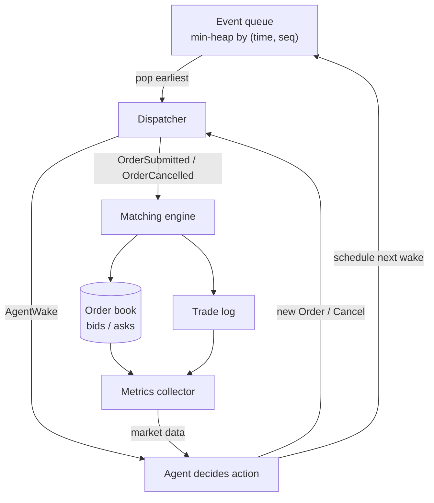

# Market Microstructure Simulator — Design

Phase 0 deliverable: core data model and event-loop design for the matching engine, before any code is written.

## 1. Core entities

### Order

```python
from dataclasses import dataclass
from enum import Enum, auto
from typing import Optional

class Side(Enum):
    BUY = auto()
    SELL = auto()

class OrderType(Enum):
    LIMIT = auto()
    MARKET = auto()

class OrderStatus(Enum):
    NEW = auto()
    PARTIALLY_FILLED = auto()
    FILLED = auto()
    CANCELLED = auto()

@dataclass
class Order:
    order_id: int
    agent_id: int
    side: Side
    order_type: OrderType
    price: Optional[int]   # integer ticks; None for MARKET orders
    quantity: int           # original size, immutable
    remaining: int          # mutable, decremented on each fill
    timestamp: float        # simulation time of submission
    seq: int                 # monotonically increasing — breaks timestamp ties
    status: OrderStatus = OrderStatus.NEW
```

**Why integer ticks, not float prices.** Comparing floats for price-level equality (`0.1 + 0.2 != 0.3`) is a classic source of matching-engine bugs. Pick a tick size up front (e.g. $0.01) and represent every price as an integer number of ticks internally; only convert to float at the display/reporting boundary.

**Why a `seq` field.** Two orders can share a timestamp (same simulated instant). Time-priority needs a deterministic tie-break, so every order gets a strictly increasing sequence number at submission — this doubles as the tie-breaker in the event queue (see §3).

### Trade

```python
@dataclass(frozen=True)
class Trade:
    trade_id: int
    timestamp: float
    price: int                # always the resting (maker) order's price
    quantity: int
    maker_order_id: int
    taker_order_id: int
    maker_agent_id: int
    taker_agent_id: int
    aggressor_side: Side       # side of the taker — the order that crossed the spread
```

`aggressor_side` matters later: it's what you'll condition on for price-impact and adverse-selection analysis in Phase 4 (Kyle/Glosten-Milgrom both hinge on who initiated the trade).

## 2. Order book structure

Two sorted maps, one per side, each mapping `price -> deque[Order]` (FIFO within a price level = time priority):

```python
from sortedcontainers import SortedDict
from collections import deque

class OrderBook:
    def __init__(self):
        self.bids: SortedDict[int, deque[Order]] = SortedDict()  # ascending; best bid = max key
        self.asks: SortedDict[int, deque[Order]] = SortedDict()  # ascending; best ask = min key
        self.orders_by_id: dict[int, Order] = {}
```

- Best bid = `bids.peekitem(-1)`, best ask = `asks.peekitem(0)` — no need to negate keys.
- `sortedcontainers.SortedDict` gives O(log n) price-level insert/remove and O(1) best-price lookup, without hand-rolling a balanced tree. This is the standard practical choice; a hand-rolled heap-of-price-levels works too but adds complexity for no real benefit at this scale.
- `orders_by_id` gives O(1) lookup for cancels.

**Matching walkthrough (incoming BUY limit order at price P, quantity Q):**
1. While the best ask ≤ P and the order still has remaining quantity: take the front (oldest) order at that price level, fill `min(remaining_incoming, remaining_resting)`, emit a `Trade`, decrement both `remaining` fields.
2. If the resting order is fully filled, pop it off the deque; if the price level empties, remove it from the `SortedDict`.
3. If the incoming order still has remaining quantity after the book is exhausted (or the best ask now exceeds P), rest what's left at price P on the bid side.
4. Market orders skip the price check and sweep until filled or the opposite side is empty — decide now whether unfilled remainder cancels or errors; most real venues cancel it (no resting market orders).

**Cancellation — a design decision worth flagging in DECISIONS.md.** Two options:
- *Lazy deletion* (simpler): mark the order `CANCELLED` in `orders_by_id`, leave it in its deque, and skip over cancelled orders when the matching loop reaches them. Cheap to implement, but a price level's live depth is no longer just "sum of resting quantity" — you need a separate running total per level if you want accurate depth for Phase 3's metrics.
- *Eager removal*: use a doubly-linked list per price level so any order can be unlinked in O(1) given a reference, keeping the deque itself always accurate. More faithful to how real matching engines actually do it (cancel-replace is extremely common in practice), at the cost of a bit more bookkeeping.

Starting with lazy deletion is a reasonable simplification for a portfolio project — just track it explicitly as a decision, and revisit if depth accuracy or performance become issues in Phase 3.

## 3. Event loop

The simulator is a discrete-event simulation: a min-heap of `(timestamp, seq, event)` tuples, popped in time order.

```python
import heapq
from itertools import count

class EventLoop:
    def __init__(self):
        self._queue: list[tuple[float, int, object]] = []
        self._seq = count()

    def schedule(self, timestamp: float, event) -> None:
        heapq.heappush(self._queue, (timestamp, next(self._seq), event))

    def run_until(self, end_time: float) -> None:
        while self._queue and self._queue[0][0] <= end_time:
            ts, seq, event = heapq.heappop(self._queue)
            event.handle(ts, self)   # dispatches to matching engine or an agent
```

Event types to start with:
- `OrderSubmitted(order)` — routed to the matching engine.
- `OrderCancelled(order_id)` — routed to the matching engine.
- `AgentWake(agent_id)` — lets an agent decide its next action (e.g. a noise trader with Poisson arrival times submits an order, then schedules its own next `AgentWake`).

The `seq` counter is shared with `Order.seq` conceptually — both exist to make "what happens at the same timestamp" deterministic and reproducible, which matters a lot once you're comparing simulation runs (Phase 4) or debugging a stress-test scenario (Phase 6).

This hand-rolled loop is deliberately simple for Phase 1–2. SimPy is worth reaching for in Phase 3 if agent scheduling logic grows complex (e.g. agents that wait on multiple conditions) — but starting hand-rolled means you actually understand the mechanics before reaching for a library that hides them, which is exactly the kind of thing a quant interviewer might probe.

## 4. Resolved decisions (see DECISIONS.md for rationale)

- **Cancellation:** lazy deletion — mark cancelled, skip during matching.
- **Self-trade prevention:** required — an agent's incoming order must never match its own resting order.
- **Market orders:** IOC semantics — fill what's available, cancel any unfilled remainder immediately. Never rests.

- **Tick size:** $0.01. `Order.price` / `Trade.price` are integer counts of cents (i.e. `price_ticks = round(price_dollars * 100)`). Convert to dollars only at the display/reporting boundary (matches real US equity tick size for stocks trading above $1).

## 5. Event-loop diagram


